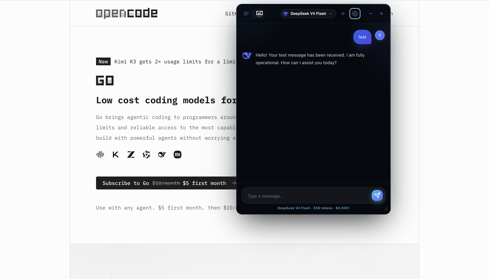
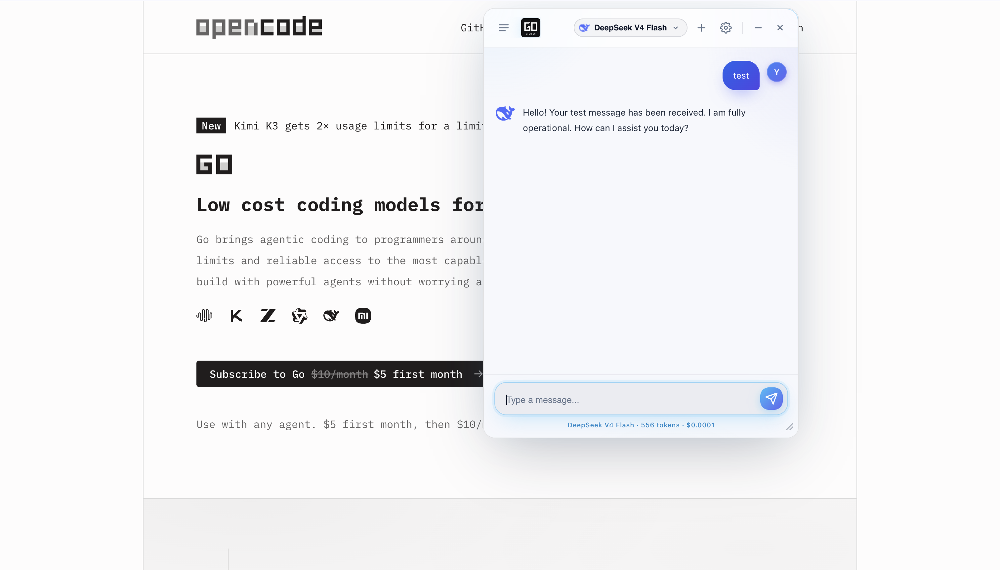

# GO Chat UI

A floating AI chat window for Chrome, powered by your own [OpenCode Go](https://opencode.ai/go) subscription. Draggable, resizable, minimizable — vanilla JS, no build step, no dependencies.

**[→ Install from the Chrome Web Store](https://chromewebstore.google.com/detail/go-chat-ui-%E2%80%94-ai-chat-for/edeahmicmaaphonflnfmjfoingkkmgnb)**



<details>
<summary>Light mode</summary>



</details>

> **Unofficial.** GO Chat UI is an independent client. It is not affiliated with, endorsed by, or sponsored by OpenCode. "OpenCode" is the trademark of its respective owner.

Your API key and every conversation are stored in `chrome.storage.local` on your own machine. There is no account, no server operated by this project, and no analytics or telemetry of any kind.

## Features

- **Floating window** — drag, resize (8 handles), minimize to a chip, position persisted
- **Click away to minimize** — optional, on by default
- **Streaming responses** — real-time SSE via the OpenAI-compatible API
- **Dynamic model list** — fetched live from `GET /zen/go/v1/models`, cached for 24h, searchable
- **Chat history** — `chrome.storage.local`, scrollable sidebar, last 50 conversations
- **Usage tracking** — per-chat tokens, plus per-day and per-model history with a 30-day chart
- **Reasoning models** — chain-of-thought hidden behind a "Thinking" indicator by default, full transcript optional
- **Markdown rendering** — code blocks, headings, lists, tables, links, images
- **Light and dark themes** — follows the system by default
- **Fallback window** — on pages where content scripts can't run (`chrome://`, Web Store, PDF viewer)

## Install

Install from the [Chrome Web Store](https://chromewebstore.google.com/detail/go-chat-ui-%E2%80%94-ai-chat-for/edeahmicmaaphonflnfmjfoingkkmgnb), then click the toolbar icon on any page and paste your [OpenCode Go API key](https://opencode.ai/go).

The key is validated against the models endpoint and stored locally in `chrome.storage.local`.

### From source

1. Clone or download this repository
2. Go to `chrome://extensions` → enable **Developer mode**
3. Click **Load unpacked** → select this folder

## Architecture

```
click toolbar icon
       │
       ▼
 background.js  ──►  executeScript('content/float.js')
       │                    │
   [restricted page?]       ├─ shadow DOM host
       │                    ├─ .oc-win  (glass frame + resize handles)
   openFallbackWindow()     ├─ <iframe> ─── popup.html (chat UI, full extension context)
       │                    └─ .oc-chip (minimized orb)
       ▼                             ▲
 popup.html  ◄── standalone window   │ postMessage bridge (drag, min, close, streaming)
 (full window, no frame chrome)      │
```

### Files

| File | Role |
|------|------|
| `manifest.json` | MV3 extension manifest — permissions, service worker, WAR |
| `background.js` | Service worker — injects content script on icon click |
| `content/float.js` | Content script — floating window chrome (shadow DOM, drag, resize, chip) |
| `content/float.css` | Styles for the floating window frame and chip |
| `popup.html` | Chat UI shell (setup screen + main app) |
| `popup.css` | Full chat UI styling — dark theme, aurora, messages, composer |
| `popup.js` | Core logic — API calls, streaming, model management, chat history |
| `options.html` | Settings page — API key, default model, chat history viewer |
| `options.js` | Settings page logic — key validation, preferences, usage charts, history |
| `theme-init.js` | Resolves the light/dark theme before first paint to avoid a flash |
| `logo.svg` | Extension logo — GO Chat UI wordmark |
| `icons/` | PNG icons (16/32/48/128) generated from `logo.svg` |

### Key design decisions

- **iframes, not popups** — the chat UI runs in an `iframe` (`popup.html`) inside a shadow DOM host on the page. The iframe has full extension context, so `chrome.storage`, `fetch`, and all extension APIs work unchanged.
- **Shadow DOM isolation** — the floating window lives in a shadow root with `all: initial` on the host. Host-page CSS cannot bleed in and our styles cannot bleed out.
- **postMessage bridge** — the chat header acts as the drag handle. `pointerdown` events in the iframe are relayed via `postMessage` to the content script, which tracks movement on the top-level document.
- **No hardcoded model data** — models, names, and display order come exclusively from the API. The brand domain mapping (`BRAND_DOMAINS`) is static infrastructure for favicon lookups — it is not model data.
- **Graceful degradation** — if the content script fails (chrome:// pages), a standalone popup window opens instead. If the models API fails, the dropdown shows empty rather than stale data.

## API

All models are fetched dynamically from:

```
https://opencode.ai/zen/go/v1/models
```

Chat completions are sent to:

```
https://opencode.ai/zen/go/v1/chat/completions
```

Requests use `Authorization: Bearer <key>` and follow the OpenAI-compatible format with `stream: true`.

Brand favicons use Google's favicon service:

```
https://www.google.com/s2/favicons?domain=<brand-domain>&sz=<size>
```

The domain mapping (`x.ai`, `deepseek.com`, `z.ai`, etc.) is the only static data in the extension.

## Development

All JS is vanilla — no build step, no dependencies. Syntax-check with:

```bash
node --check popup.js content/float.js background.js options.js
```

Regenerate icons after changing `logo.svg`:

```bash
cd icons
for size in 16 32 48 128; do
  rsvg-convert -w $size -h $size ../logo.svg -o "icon${size}.png"
done
```

## Feedback

Bugs and feature requests: open an issue. General feedback:
[bambamhq.com/contact](https://www.bambamhq.com/contact.html?app=gochatui).

## Disclosures

- **Unofficial client.** Not affiliated with, endorsed by, or sponsored by OpenCode.
  "OpenCode" is the trademark of its respective owner.
- **No data collection.** The extension has no analytics, no telemetry, and no
  backend. Your key and conversations never leave your machine, except that your
  messages are sent to OpenCode's API so the model can answer them. Model brand
  icons are loaded from Google's public favicon service.

## Licence

[Apache License 2.0](LICENSE).

## Trademarks

Apache 2.0 grants no trademark rights (§6). The GO Chat UI name, logo, and icons
are not covered by the code licence and remain the property of BAMBAM LLC. Forks
are welcome but must use their own name and branding.
